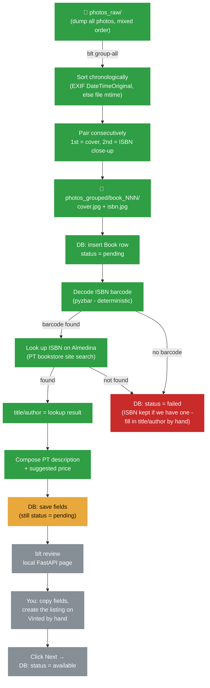

# Book Listing Automation (blt)


CLI + local web tool that helps list used books for sale on Vinted: take phone photos, decode the ISBN barcode and **look up title/author deterministically** (barcode + bookstore site search, no guessing), and get a simple review page to copy the info into Vinted and track what's been listed. Nothing touches Vinted programmatically — you create the actual listing by hand.

## Why not automate the Vinted posting itself?

We tried (see the `feat/vinted-http-api` branch for the full trail). Vinted has no public API for individual sellers, and every automated-posting approach — Selenium, direct HTTP calls replaying a captured session, even `fetch()` executed inside an authenticated browser tab — eventually hit a real anti-bot wall: CAPTCHA, a full IP/session block, Chromium's App-Bound Encryption, or Datadome's TLS/behavioral fingerprinting. Rather than keep fighting systems specifically built to stop this, this tool automates *everything except* the final "create listing" click, which you do yourself in a couple of minutes per book.

## Flow



🟢 done · 🟡 in progress · ⚪ not started yet

## Status (2026-07-23)

| # | Issue | Status |
|---|---|---|
| [#1](https://github.com/gab-es21/book-listing-automation/issues/1) | Photo intake: sort & pair into cover/back folders | 🟢 done |
| [#2](https://github.com/gab-es21/book-listing-automation/issues/2) | SQLite schema & book status state machine | 🟢 done |
| [#3](https://github.com/gab-es21/book-listing-automation/issues/3) | Local vision extraction via Ollama | 🟢 done |
| [#4](https://github.com/gab-es21/book-listing-automation/issues/4) | Structured field filter (title/author/isbn) | 🟢 done |
| [#5](https://github.com/gab-es21/book-listing-automation/issues/5) | Description & price composition | 🟢 done |
| [#6](https://github.com/gab-es21/book-listing-automation/issues/6) | `blt extract` CLI command | 🟡 in progress |
| [#7](https://github.com/gab-es21/book-listing-automation/issues/7) | Local review frontend (FastAPI) | ⚪ not started |
| [#8](https://github.com/gab-es21/book-listing-automation/issues/8) | Cleanup old Vinted-automation/Supabase code | 🟢 done |

## Fixed by design (not extracted, not automated)

Category, condition, and language are always the same for every listing, so the tool never tries to detect or set them — pick them by hand in Vinted's UI each time. Pasting a valid ISBN into Vinted's own form auto-fills title/author/language there too, which is why getting the ISBN right is so valuable.

Price is a flat `BOOK_PRICE_EUR` (default €7) for every book - not computed, not negotiated in the description text. Negotiation happens through Vinted's own offer feature; the description never mentions a price floor. Transport isn't mentioned either - Vinted handles shipping natively, so there's nothing to describe about delivery/shipping arrangements.

## ISBN-first extraction strategy

There's no reliable alternative to a real ISBN, so this doesn't try to guess one: `pyzbar` decodes the actual EAN-13 barcode from the ISBN close-up photo - a solved, deterministic computer-vision problem, not OCR. A successful decode already implies a valid checksum (the EAN-13 standard requires it).

Once we have a real ISBN, we look it up on **Almedina** (a Portuguese bookstore's own site search - good coverage for small local-press/book-club editions; personal low-volume use only, honest self-identifying User-Agent, not for bulk scraping).

If the barcode can't be decoded, or Almedina doesn't have that ISBN, the book is **not** guessed at via a vision model reading the cover — it's marked `status = failed` and left for you to fill in by hand. Live testing showed small local vision models misreading fine print often enough that trusting them wasn't worth it; a barcode is either read correctly or not read at all, so "give up and ask a human" beats "confidently guess wrong." If a barcode was decoded but the lookup came up empty, that ISBN is still saved - pasting a valid ISBN into Vinted's own form auto-fills title/author/language there too, so it's still useful even without a title match.

Google Books was tried first and dropped: its anonymous tier's daily quota was easily exhausted, and even with a personal API key its `isbn:`-query backend had its own outage (`503` on any numeric query, even a well-known English ISBN - unrelated to anything on our end). Too unreliable to depend on compared to barcode+Almedina.

## Known limitation: some books need manual entry

Almedina doesn't carry every book, and not every barcode photo decodes cleanly (glare, blur, a bent spine). Either case leaves a book at `status = failed` instead of a guessed title/author. This is expected, not a bug — the review step (#7) will surface these separately so you can type in the missing fields by hand instead of trusting an unreliable guess.

## Setup

1. `pip install -r requirements.txt`
2. Copy `.env.example` to `.env` and adjust `BOOK_PRICE_EUR` if needed.
3. `blt initdb`

## CLI commands

| Command | Does |
|---|---|
| `blt initdb` | create the local SQLite schema |
| `blt group-all` | sort+pair everything in `photos_raw/` into `photos_grouped/book_NNN/` |
| `blt convert-heic PATH` | convert HEIC/HEIF photos to JPEG in place |
| `blt extract [--limit N]` | run barcode+Almedina extraction on pending books missing data; unresolved ones are marked `failed` |
| `blt review` | *(planned, #7)* open the local copy-paste review page |

## Testing

`pytest` (unit tests use synthetic images + `tmp_path`, no real photos or Ollama needed). Runs automatically on every push/PR via GitHub Actions.

```bash
pip install -r requirements.txt
pytest -v
```
