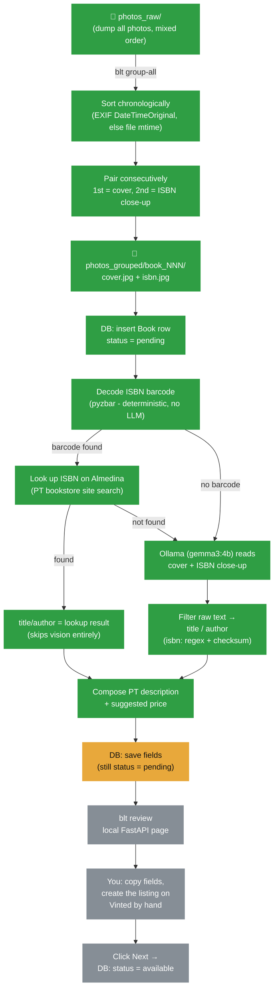

# Book Listing Automation (blt)


CLI + local web tool that helps list used books for sale on Vinted: take phone photos, read title/author/ISBN off the covers with a **local, offline vision model**, and get a simple review page to copy the info into Vinted and track what's been listed. Nothing touches Vinted programmatically — you create the actual listing by hand.

## Why not automate the Vinted posting itself?

We tried (see the `feat/vinted-http-api` branch for the full trail). Vinted has no public API for individual sellers, and every automated-posting approach — Selenium, direct HTTP calls replaying a captured session, even `fetch()` executed inside an authenticated browser tab — eventually hit a real anti-bot wall: CAPTCHA, a full IP/session block, Chromium's App-Bound Encryption, or Datadome's TLS/behavioral fingerprinting. Rather than keep fighting systems specifically built to stop this, this tool automates *everything except* the final "create listing" click, which you do yourself in a couple of minutes per book.

## Flow



🟢 done · 🟡 in progress · ⚪ not started yet

## Status (2026-07-23)

| # | Issue | Status |
|---|---|---|
| [#1](https://github.com/gab-es21/book-listing-automation/issues/1) | Photo intake: sort & pair into cover/back folders | 🟢 done |
| [#2](https://github.com/gab-es21/book-listing-automation/issues/2) | SQLite schema & book status state machine | 🟢 done |
| [#3](https://github.com/gab-es21/book-listing-automation/issues/3) | Local vision extraction via Ollama | 🟢 done |
| [#4](https://github.com/gab-es21/book-listing-automation/issues/4) | Structured field filter (title/author/isbn) | 🟢 done |
| [#5](https://github.com/gab-es21/book-listing-automation/issues/5) | Description & price composition | 🟢 done |
| [#6](https://github.com/gab-es21/book-listing-automation/issues/6) | `blt extract` CLI command | ⚪ not started |
| [#7](https://github.com/gab-es21/book-listing-automation/issues/7) | Local review frontend (FastAPI) | ⚪ not started |
| [#8](https://github.com/gab-es21/book-listing-automation/issues/8) | Cleanup old Vinted-automation/Supabase code | 🟢 done |

## Fixed by design (not extracted, not automated)

Category, condition, and language are always the same for every listing, so the tool never tries to detect or set them — pick them by hand in Vinted's UI each time. Pasting a valid ISBN into Vinted's own form auto-fills title/author/language there too, which is why getting the ISBN right is so valuable.

Price is a flat `BOOK_PRICE_EUR` (default €7) for every book - not computed, not negotiated in the description text. Negotiation happens through Vinted's own offer feature; the description never mentions a price floor. Transport isn't mentioned either - Vinted handles shipping natively, so there's nothing to describe about delivery/shipping arrangements.

## ISBN-first extraction strategy

Live testing showed the local vision model reading fine print (barcodes, small ISBN text) unreliably enough to matter, so ISBN doesn't rely on OCR at all: `pyzbar` decodes the actual EAN-13 barcode from the ISBN close-up photo - a solved, deterministic computer-vision problem, not a guess. A successful decode already implies a valid checksum (the EAN-13 standard requires it).

Once we have a real ISBN, we look it up rather than trust whatever's readable on the cover: **Almedina** (a Portuguese bookstore's own site search - good coverage for small local-press/book-club editions; personal low-volume use only, honest self-identifying User-Agent, not for bulk scraping). Only when the barcode is missing/unreadable, or the lookup doesn't find the ISBN, does it fall back to the local vision model reading the cover + a text-filter step - which is where remaining unreliability lives (see below).

Google Books was tried first and dropped: its anonymous tier's daily quota was easily exhausted, and even with a personal API key its `isbn:`-query backend had its own outage (`503` on any numeric query, even a well-known English ISBN - unrelated to anything on our end). Too unreliable to depend on compared to barcode+Almedina.

## Known limitation: the vision+filter fallback is best-effort, not authoritative

Small local models aren't perfectly reliable — across real testing, title/author extraction from a photographed cover occasionally missed or misread the actual title (especially when the cover transcription step didn't clearly capture it in the first place), and once even returned the literal string `"null"` instead of an actual null value (now normalized). This only matters when the ISBN-first path above doesn't resolve a book. It's exactly why the review step (#7) shows editable fields rather than auto-submitting anything — you're always meant to glance at the extracted data before pasting it, not trust it blindly.

## Setup

1. `pip install -r requirements.txt`
2. Copy `.env.example` to `.env` and adjust `BOOK_PRICE_EUR` and the `OLLAMA_*` settings if needed.
3. Have [Ollama](https://ollama.com) running locally with `gemma3:4b` and `phi4-mini` pulled — already validated on real book covers.
4. `blt initdb`

## CLI commands

| Command | Does |
|---|---|
| `blt initdb` | create the local SQLite schema |
| `blt group-all` | sort+pair everything in `photos_raw/` into `photos_grouped/book_NNN/` |
| `blt convert-heic PATH` | convert HEIC/HEIF photos to JPEG in place |
| `blt extract` | *(planned, #6)* run local vision extraction on pending books |
| `blt review` | *(planned, #7)* open the local copy-paste review page |

## Testing

`pytest` (unit tests use synthetic images + `tmp_path`, no real photos or Ollama needed). Runs automatically on every push/PR via GitHub Actions.

```bash
pip install -r requirements.txt
pytest -v
```
