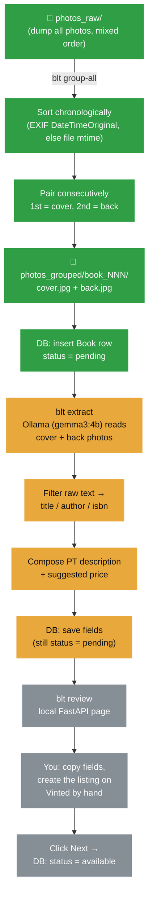

# Book Listing Automation (blt)


CLI + local web tool that helps list used books for sale on Vinted: take phone photos, read title/author/ISBN off the covers with a **local, offline vision model**, and get a simple review page to copy the info into Vinted and track what's been listed. Nothing touches Vinted programmatically — you create the actual listing by hand.

## Why not automate the Vinted posting itself?

We tried (see the `feat/vinted-http-api` branch for the full trail). Vinted has no public API for individual sellers, and every automated-posting approach — Selenium, direct HTTP calls replaying a captured session, even `fetch()` executed inside an authenticated browser tab — eventually hit a real anti-bot wall: CAPTCHA, a full IP/session block, Chromium's App-Bound Encryption, or Datadome's TLS/behavioral fingerprinting. Rather than keep fighting systems specifically built to stop this, this tool automates *everything except* the final "create listing" click, which you do yourself in a couple of minutes per book.

## Flow



🟢 done · 🟡 in progress · ⚪ not started yet

## Status (2026-07-23)

| # | Issue | Status |
|---|---|---|
| [#1](https://github.com/gab-es21/book-listing-automation/issues/1) | Photo intake: sort & pair into cover/back folders | 🟢 done |
| [#2](https://github.com/gab-es21/book-listing-automation/issues/2) | SQLite schema & book status state machine | ⚪ not started |
| [#3](https://github.com/gab-es21/book-listing-automation/issues/3) | Local vision extraction via Ollama | ⚪ not started |
| [#4](https://github.com/gab-es21/book-listing-automation/issues/4) | Structured field filter (title/author/isbn) | ⚪ not started |
| [#5](https://github.com/gab-es21/book-listing-automation/issues/5) | Description & price composition | ⚪ not started |
| [#6](https://github.com/gab-es21/book-listing-automation/issues/6) | `blt extract` CLI command | ⚪ not started |
| [#7](https://github.com/gab-es21/book-listing-automation/issues/7) | Local review frontend (FastAPI) | ⚪ not started |
| [#8](https://github.com/gab-es21/book-listing-automation/issues/8) | Cleanup old Vinted-automation/Supabase code | 🟢 done |

## Fixed by design (not extracted, not automated)

Category, condition, and language are always the same for every listing, so the tool never tries to detect or set them — pick them by hand in Vinted's UI each time. Pasting a valid ISBN into Vinted's own form auto-fills title/author/language there too, which is why ISBN is the single highest-value thing for the vision step to get right.

## Setup

1. `pip install -r requirements.txt`
2. Copy `.env.example` to `.env` and adjust `SELLER_LOCATION`/`SELLER_SHIPPING` and the `OLLAMA_*` settings if needed.
3. Have [Ollama](https://ollama.com) running locally with `gemma3:4b` pulled (`ollama pull gemma3:4b`) — already validated on real book covers.
4. `blt initdb`

## CLI commands

| Command | Does |
|---|---|
| `blt initdb` | create the local SQLite schema |
| `blt group-all` | sort+pair everything in `photos_raw/` into `photos_grouped/book_NNN/` |
| `blt convert-heic PATH` | convert HEIC/HEIF photos to JPEG in place |
| `blt extract` | *(planned, #6)* run local vision extraction on pending books |
| `blt review` | *(planned, #7)* open the local copy-paste review page |

## Testing

`pytest` (unit tests use synthetic images + `tmp_path`, no real photos or Ollama needed). Runs automatically on every push/PR via GitHub Actions.

```bash
pip install -r requirements.txt
pytest -v
```
