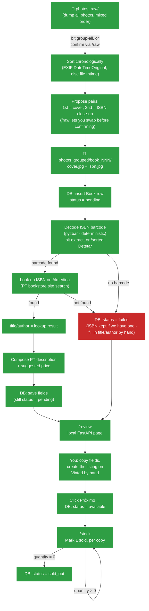

# Book Listing Automation (blt)


CLI + local web tool that helps list used books for sale on Vinted: take phone photos, decode the ISBN barcode and **look up title/author deterministically** (barcode + bookstore site search, no guessing), and get a simple review page to copy the info into Vinted and track what's been listed. Nothing touches Vinted programmatically — you create the actual listing by hand.

## Why not automate the Vinted posting itself?

We tried (see the `feat/vinted-http-api` branch for the full trail). Vinted has no public API for individual sellers, and every automated-posting approach — Selenium, direct HTTP calls replaying a captured session, even `fetch()` executed inside an authenticated browser tab — eventually hit a real anti-bot wall: CAPTCHA, a full IP/session block, Chromium's App-Bound Encryption, or Datadome's TLS/behavioral fingerprinting. Rather than keep fighting systems specifically built to stop this, this tool automates *everything except* the final "create listing" click, which you do yourself in a couple of minutes per book.

## Flow


```mermaid
flowchart TD
    A["📁 photos_raw/\n(dump all photos, mixed order)"] -->|"blt group-all, or\nconfirm via /raw"| B["Sort chronologically\n(EXIF DateTimeOriginal, else file mtime)"]
    B --> C["Propose pairs:\n1st = cover, 2nd = ISBN close-up\n(/raw lets you swap before confirming)"]
    C --> D["📁 photos_grouped/book_NNN/\ncover.jpg + isbn.jpg"]
    D --> E["DB: insert Book row\nstatus = pending"]

    E --> F["Decode ISBN barcode\n(pyzbar - deterministic)\nblt extract, or /sorted Detetar"]
    F -->|"barcode found"| G["Look up ISBN on Almedina\n(PT bookstore site search)"]
    G -->|"found"| H1["title/author = lookup result"]
    G -->|"not found"| Z["DB: status = failed\n(ISBN kept if we have one -\nfill in title/author by hand)"]
    F -->|"no barcode"| Z

    H1 --> I["Compose PT description\n+ suggested price"]
    I --> J["DB: save fields\n(still status = pending)"]

    J --> K["/review\nlocal FastAPI page"]
    Z --> K
    K --> L["You: copy fields,\ncreate the listing on\nVinted by hand"]
    L --> M["Click Próximo →\nDB: status = available"]
    M --> N["/stock\nMark 1 sold, per copy"]
    N -->|"quantity > 0"| N
    N -->|"quantity = 0"| O["DB: status = sold_out"]

    class A,B,C,D,E,F,G,H1,I,J,K,L,M,N,O done
    class Z failed

    classDef done fill:#2f9e44,color:#fff,stroke:#2f9e44
    classDef failed fill:#c92a2a,color:#fff,stroke:#c92a2a
```

🟢 done · 🟡 in progress · ⚪ not started yet

## Status (2026-07-23)

| # | Issue | Status |
|---|---|---|
| [#1](https://github.com/gab-es21/book-listing-automation/issues/1) | Photo intake: sort & pair into cover/back folders | 🟢 done |
| [#2](https://github.com/gab-es21/book-listing-automation/issues/2) | SQLite schema & book status state machine | 🟢 done |
| [#3](https://github.com/gab-es21/book-listing-automation/issues/3) | Local vision extraction via Ollama | 🟢 done |
| [#4](https://github.com/gab-es21/book-listing-automation/issues/4) | Structured field filter (title/author/isbn) | 🟢 done |
| [#5](https://github.com/gab-es21/book-listing-automation/issues/5) | Description & price composition | 🟢 done |
| [#6](https://github.com/gab-es21/book-listing-automation/issues/6) | `blt extract` CLI command | 🟢 done |
| [#7](https://github.com/gab-es21/book-listing-automation/issues/7) | Local review frontend (FastAPI) | 🟢 done |
| [#8](https://github.com/gab-es21/book-listing-automation/issues/8) | Cleanup old Vinted-automation/Supabase code | 🟢 done |

## Fixed by design (not extracted, not automated)

Category, condition, and language are always the same for every listing, so the tool never tries to detect or set them — pick them by hand in Vinted's UI each time. Pasting a valid ISBN into Vinted's own form auto-fills title/author/language there too, which is why getting the ISBN right is so valuable.

Price is a flat `BOOK_PRICE_EUR` (default €7) for every book - not computed, not negotiated in the description text. Negotiation happens through Vinted's own offer feature; the description never mentions a price floor. Transport isn't mentioned either - Vinted handles shipping natively, so there's nothing to describe about delivery/shipping arrangements.

## ISBN-first extraction strategy

There's no reliable alternative to a real ISBN, so this doesn't try to guess one: `pyzbar` decodes the actual EAN-13 barcode from the ISBN close-up photo - a solved, deterministic computer-vision problem, not OCR. A successful decode already implies a valid checksum (the EAN-13 standard requires it).

Once we have a real ISBN, we look it up on **Almedina** (a Portuguese bookstore's own site search - good coverage for small local-press/book-club editions; personal low-volume use only, authorized directly by contacts who run the site). Every lookup sleeps a random 0.5-1.5s before making the request as simple good manners, enforced inside the lookup function itself rather than left to callers to remember. A real browser User-Agent is used rather than an honest custom one - confirmed directly: an earlier honest, self-identifying UA got blocked on every single request across several days, while the exact same request with a real Chrome UA succeeded immediately, repeatedly. What looked like a rate-limit block was actually that UA string being filtered.

If the barcode can't be decoded, or Almedina doesn't have that ISBN, the book is **not** guessed at via a vision model reading the cover — it's marked `status = failed` and left for you to fill in by hand. Live testing showed small local vision models misreading fine print often enough that trusting them wasn't worth it; a barcode is either read correctly or not read at all, so "give up and ask a human" beats "confidently guess wrong." If a barcode was decoded but the lookup came up empty, that ISBN is still saved - pasting a valid ISBN into Vinted's own form auto-fills title/author/language there too, so it's still useful even without a title match.

Google Books was tried first and dropped: its anonymous tier's daily quota was easily exhausted, and even with a personal API key its `isbn:`-query backend had its own outage (`503` on any numeric query, even a well-known English ISBN - unrelated to anything on our end). Too unreliable to depend on compared to barcode+Almedina.

## Known limitation: some books need manual entry

Almedina doesn't carry every book, and not every barcode photo decodes cleanly (glare, blur, a bent spine). Either case leaves a book at `status = failed` instead of a guessed title/author. This is expected, not a bug — the review step (#7) will surface these separately so you can type in the missing fields by hand instead of trusting an unreliable guess.

## Local web app

`blt review` starts a small FastAPI app bound to `localhost` only. A full-height left sidebar covers the whole flow as four steps (each with a matching icon), a live count each; at the top of the content column on every page (not the sidebar, not a page-wide banner) sits a stacked percentage bar across those same four steps - one fixed color per step, matched by a legend below it, both linking to that step. A faint per-unit tick overlay marks off each individual book within the bar, spaced evenly based on the real total (so it's never a division-by-zero when there's nothing to show yet). `html { scrollbar-gutter: stable }` keeps this bar (and everything else shared across pages) pixel-identical regardless of whether a given page happens to need a vertical scrollbar - without it, the couple of pixels a scrollbar takes up would shift the whole layout by a few mm from page to page. The landing page (`/`) is a dashboard showing the same four steps as a flow diagram, followed by running totals (revenue, units sold), a bar chart + table for weekly revenue, and a bar chart + table for books added over time - computed straight from the `sales` and `books` tables (no separate history page needed). Single-series bar charts in the app's own accent color, thin capped bars, a plain SVG hairline baseline, hover for the exact value - no charting library, consistent with the rest of the app.

The header's percentage bar counts a "book" a little differently than the sidebar's plain counts do: a raw photo pair is one book, but a lone unpaired photo (waiting for its match) is only half a book for this specific calculation - it exists, but isn't usable yet. This only affects the header bar's percentages; the sidebar's "Imagens raw" badge still shows a plain photo count.

There's no login/auth - by design, for a single-user localhost tool - so every state-changing route (delete, mark sold, edit, confirm, etc.) is guarded by a small middleware that rejects any POST/PUT/PATCH/DELETE whose `Origin`/`Referer` isn't `localhost`/`127.0.0.1`. Modern browsers attach `Origin` to every POST regardless of CORS, so a malicious site's hidden form targeting this port while `blt review` happens to be running in the background gets a `403`, not a silently-executed delete. Requests with no `Origin`/`Referer` at all (curl, scripts, the test suite) are let through, since that's not the browser-navigation attack this guards against.

- **Imagens raw** (`/raw`) - every photo still in `photos_raw/`, paired the same way `group-all` would, with a cover/ISBN label under each photo so you can check the proposal before committing to anything. **Ordenar como sugerido** confirms the whole batch at once; each pair also has its own confirm button plus a **Trocar capa/ISBN** toggle, in case the chronological guess picked the wrong photo first. An odd unpaired photo is shown separately, waiting for its match - never guessed into a pair.
- **Imagens ordenadas** (`/sorted`) - grouped `book_NNN` folders that extraction hasn't touched yet (a freshly-grouped book is `status="pending"` with `title` still empty - the same shape extraction later fills in or fails, so no new column was needed to track this). **Detetar livros** runs barcode+Almedina extraction over all of them at once (same as `blt extract`).
- **Livros por confirmar** (`/review`) - the original review page: oldest resolved-or-failed book, one at a time, both photos inline, editable copy-paste form ordered the way you actually fill Vinted's own form: título, autor, descrição, ISBN, preço, then quantidade (our own field, not Vinted's). `failed` books get the same form with blank título/autor for manual entry. Every field has a one-click **Copiar** button. **Próximo** saves your edits and marks the book `available` - it means "I already created the real Vinted listing." `/previous` is a safety net to recheck the last-reviewed book, with a way to send it back to `pending` if you catch a mistake.
- **Stock** (`/stock`) - every listed book, searchable by título/ISBN/autor, sortable by any column, paginated 20-per-page by default (or "ver tudo" for everything in one scrollable table), each with its remaining `quantity` and a **Marcar 1 vendido** button. `quantity` isn't a Vinted field (each physical copy still needs its own separate listing there), it's this tool's own stock counter: decrementing it flips the book to `status = sold_out` once it hits zero. Sold-out books stay visible (styled distinctly, sorted to the bottom of the list, no button) rather than disappearing - useful for a quick sales history at a glance. A pencil icon per row expands an edit form below that row (título/autor/isbn/preço/quantidade) with check/cross icon buttons to save or discard - deliberately not auto-save-on-change, since `<input type="number">` responds to mouse-wheel scrolling and could silently change the price if it auto-saved. Both start disabled (grey) until a field actually changes, then turn green/red respectively. Setting quantidade to 0 here flips status to `sold_out`, matching what selling out the normal way does. A trash icon next to it deletes the book from the DB outright (any status) after a confirm prompt - the photo folder on disk is left alone.
- **Marcar 1 vendido** records a `Sale` row - a permanent snapshot (título, isbn, price at the moment of sale, timestamp) independent of the `Book` row, so sales history survives even if the book is later deleted. The price used is whatever's currently saved on the book, so editing price right before selling captures a negotiated price correctly.

## Development mode

`DEV_MODE=true` in `.env` makes the whole pipeline safe to run repeatedly against the same fixed set of test photos, instead of consuming them like real usage does:

- **Photo intake** (`blt convert-heic`, `blt group-all`) copies instead of moving/deleting - `photos_raw/` always keeps its originals.
- **`blt group-all`** resets first: it clears out any existing `pending`/`failed` book folders + DB rows before regrouping fresh from the same raw photos, so you always get the same small batch back instead of piling up `book_004`, `book_005`, ... on every run. It **never touches `available`/`sold_out` rows** - real listing/sale history survives regardless of `DEV_MODE`.
- **`blt extract`** reuses any title/author it's already resolved for that exact ISBN before (from any earlier real lookup) instead of hitting Almedina again - only a genuinely new ISBN triggers a real (still paced) lookup.
- **The review page** (`/review`) never promotes a book to `available` on **Próximo** - it saves your edits and cycles to the next pending/failed book by id (wrapping back to the first once you reach the end), so the queue never empties. A "DEV MODE" badge on the page makes this obvious at a glance.

Default is `false` - leave it that way for real usage.

## Setup

This project uses [uv](https://docs.astral.sh/uv/) to manage the Python version, virtualenv, and dependencies - no separate `pip install`/`venv` steps needed.

1. Install `uv` if you don't have it already (see the link above).
2. `uv sync` - creates `.venv/`, installs the pinned Python version (`.python-version`), and installs every dependency (including dev tools) from `uv.lock`. This also installs the `blt` package itself in editable mode, registering the `blt` command inside that venv.
3. Copy `.env.example` to `.env` and adjust `BOOK_PRICE_EUR` if needed.
4. `uv run blt initdb` - creates `blt.db` (SQLite, a plain file in the project root) with the `books` and `sales` tables. All data - every book, photo path, and sale - lives in that one file plus the `photos_raw/`/`photos_grouped/` folders, so it persists across restarts and across machine reboots; nothing here is in-memory or session-scoped.
5. `uv run blt review` to start the local web app (see below) - `Ctrl+C` in that terminal stops it. Safe to stop and restart anytime; it always resumes from whatever's in `blt.db`.

(`uv run <command>` runs inside the managed venv without needing to activate it manually; you can also `.venv\Scripts\activate` (Windows) / `source .venv/bin/activate` and drop the `uv run` prefix.)

## CLI commands

| Command | Does |
|---|---|
| `blt initdb` | create the local SQLite schema |
| `blt group-all` | sort+pair everything in `photos_raw/` into `photos_grouped/book_NNN/` |
| `blt convert-heic PATH` | convert HEIC/HEIF photos to JPEG in place |
| `blt extract [--limit N]` | run barcode+Almedina extraction on pending books missing data; unresolved ones are marked `failed` |
| `blt review [--host] [--port]` | open the local web app - dashboard at `/`, plus `/raw`, `/sorted`, `/review`, `/stock` |

(run any of these as `uv run blt ...`, or drop the `uv run` prefix once the venv is activated.)

## Testing

`pytest` (unit tests use synthetic images + `tmp_path`, no real photos or Ollama needed). Runs automatically on every push/PR via GitHub Actions.

```bash
uv sync
uv run pytest -v
```

## Contributing / branching

`main` and `alpha` are permanent branches - nothing is committed to either directly. All work happens on a `feature/*` or `fix/*` branch cut from `alpha`, merged back via PR once CI (lint, types, tests with coverage) passes. `alpha` periodically gets merged into `main` as a tagged release. See [CLAUDE.md](CLAUDE.md) for the exact commands and rules an agent session should follow.
