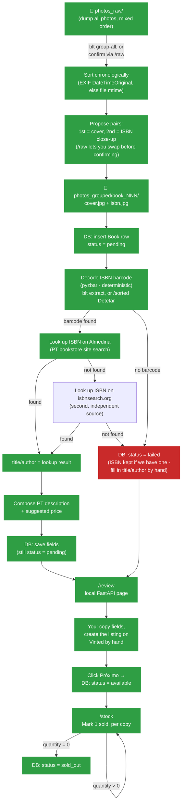
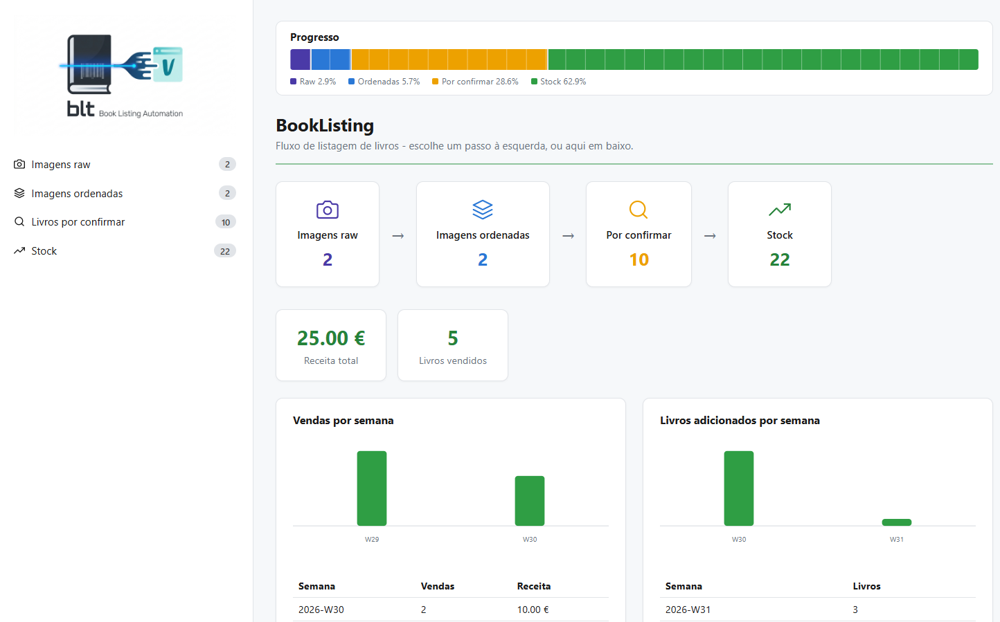
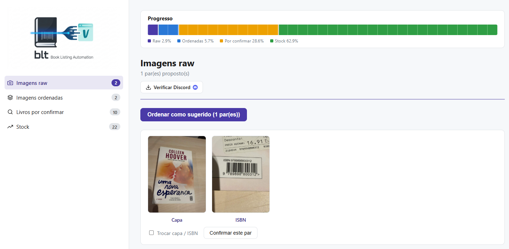
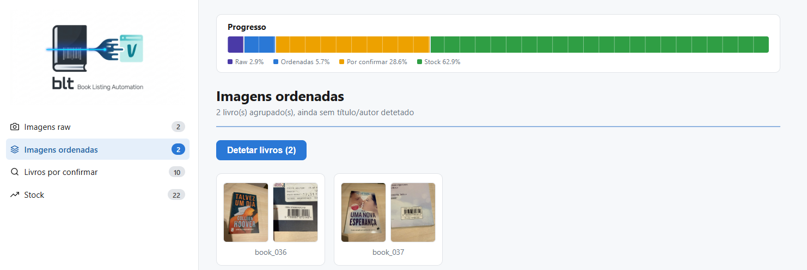
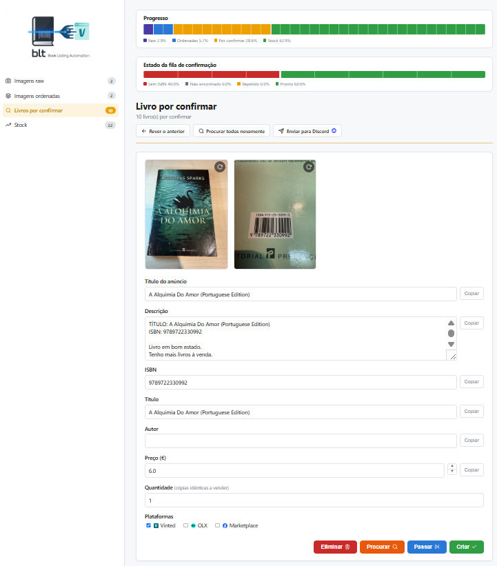

# Book Listing Automation (blt)


CLI + local web tool that helps list used books for sale on Vinted: take phone photos, decode the ISBN barcode and **look up title/author deterministically** (barcode + bookstore site search, no guessing), then use a simple local review page to copy the info into Vinted and track what's been listed.

> Nothing here touches Vinted programmatically. You still create the actual listing by hand - this tool just does all the prep work for you.

## Contents

- [Book Listing Automation (blt)](#book-listing-automation-blt)
  - [Contents](#contents)
  - [Quick start](#quick-start)
  - [How it works](#how-it-works)
  - [The web app](#the-web-app)
  - [Screenshots](#screenshots)
  - [Discord notifications](#discord-notifications)
  - [Faster photo intake via Discord](#faster-photo-intake-via-discord)
  - [ISBN-first extraction](#isbn-first-extraction)
  - [Development mode](#development-mode)
  - [CLI reference](#cli-reference)
  - [Why not automate the Vinted posting itself?](#why-not-automate-the-vinted-posting-itself)
  - [Testing](#testing)
  - [Contributing / branching](#contributing--branching)

## Quick start

Requires [uv](https://docs.astral.sh/uv/) - it manages the Python version, virtualenv, and dependencies for you, so there's no separate `pip install`/`venv` setup.

```bash
git clone https://github.com/gab-es21/book-listing-automation.git
cd book-listing-automation
uv sync
cp .env.example .env
uv run blt initdb
uv run blt review
```

Then open **`http://127.0.0.1:8000`** in your browser. `Ctrl+C` stops the server - it's always safe to stop and restart, everything resumes from `blt.db`.

Next time, take some phone photos into `photos_raw/` (cover, then ISBN barcode close-up, for each book) and run:

```bash
uv run blt group-all   # sort + pair the raw photos into photos_grouped/book_NNN/
uv run blt extract     # decode barcodes + look up title/author
uv run blt review      # then work through /raw -> /sorted -> /review -> /stock in the browser
```

## How it works


```mermaid
flowchart TD
    A["📁 photos_raw/\n(dump all photos, mixed order)"] -->|"blt group-all, or\nconfirm via /raw"| B["Sort chronologically\n(EXIF DateTimeOriginal, else file mtime)"]
    B --> C["Propose pairs:\n1st = cover, 2nd = ISBN close-up\n(/raw lets you swap before confirming)"]
    C --> D["📁 photos_grouped/book_NNN/\ncover.jpg + isbn.jpg"]
    D --> E["DB: insert Book row\nstatus = pending"]

    E --> F["Decode ISBN barcode\n(pyzbar - deterministic)\nblt extract, or /sorted Detetar"]
    F -->|"barcode found"| G["Look up ISBN on Almedina\n(PT bookstore site search)"]
    G -->|"found"| H1["title/author = lookup result"]
    G -->|"not found"| G2["Look up ISBN on isbnsearch.org\n(second, independent source)"]
    G2 -->|"found"| H1
    G2 -->|"not found"| Z["DB: status = failed\n(ISBN kept if we have one -\nfill in title/author by hand)"]
    F -->|"no barcode"| Z

    H1 --> I["Compose PT description\n+ suggested price"]
    I --> J["DB: save fields\n(still status = pending)"]

    J --> K["/review\nlocal FastAPI page"]
    Z --> K
    K --> L["You: copy fields,\ncreate the listing on\nVinted by hand"]
    L --> M["Click Próximo →\nDB: status = available"]
    M --> N["/stock\nMark 1 sold, per copy"]
    N -->|"quantity > 0"| N
    N -->|"quantity = 0"| O["DB: status = sold_out"]

    class A,B,C,D,E,F,G,H1,I,J,K,L,M,N,O done
    class Z failed

    classDef done fill:#2f9e44,color:#fff,stroke:#2f9e44
    classDef failed fill:#c92a2a,color:#fff,stroke:#c92a2a
```

Every step above is implemented and shipped as of `v0.1.0` - see [CHANGELOG.md](CHANGELOG.md) for the release history.

**Fixed by design** (not extracted, not automated): category, condition, and language are always the same for every listing, so pick them by hand in Vinted's UI each time - pasting a valid ISBN into Vinted's own form auto-fills title/author/language there too. Price is a flat `BOOK_PRICE_EUR` (default €8, set a bit above the actual asking price to leave room for Vinted's offer negotiations) for every book, not computed or mentioned as a negotiable floor in the description. Transport isn't mentioned either, since Vinted handles shipping natively.

## The web app

`blt review` starts a small FastAPI app bound to `localhost` only, organized as four steps behind a persistent sidebar with a live cross-page progress bar (one color per step, a tick mark per book, always up to date).

| Step | Page | What it's for |
| --- | --- | --- |
| 1 | **Imagens raw** (`/raw`) | Review/confirm the proposed cover+ISBN photo pairing before committing anything. Swap a pair's cover/ISBN if the chronological guess picked wrong; unpaired photos wait separately, never guessed into a pair. |
| 2 | **Imagens ordenadas** (`/sorted`) | Grouped `book_NNN` folders waiting on extraction. **Detetar livros** runs barcode+Almedina(+isbnsearch.org fallback) extraction over all of them at once (same as `blt extract`). |
| 3 | **Livros por confirmar** (`/review`) | The copy-paste review page: one book at a time, both photos inline, an editable form (título, autor, descrição, ISBN, preço, quantidade) ordered the way Vinted's own form asks for it. One-click **Copiar** per field. **Próximo** saves your edits and marks the book `available` - meaning "I already created the real Vinted listing." `/previous` is a safety net to recheck the last-reviewed book and send it back to `pending` if you catch a mistake. **Eliminar** permanently removes a book that's not worth listing - both its photos and its database entry - separate from `/stock`'s delete, which only removes an already-listed entry. |
| 4 | **Stock** (`/stock`) | Every listed book - searchable, sortable, paginated - with its remaining `quantity` and a **Marcar 1 vendido** button. Inline edit (pencil icon) and delete (trash icon) per row. Sold-out books stay visible, styled distinctly, instead of disappearing. |

The landing page (`/`) is a dashboard: the same four steps as a flow diagram, running totals (revenue, units sold), and bar charts for weekly revenue and books added over time - all computed straight from the database, no separate history page needed. Charts are hand-rolled SVG (thin capped bars, a hairline baseline, hover for the exact value) - no charting library dependency.

<details>
<summary><strong>More detail: sales history, security, and the progress bar</strong></summary>

- **Sales history** - every unit sold records its own `Sale` row (título, isbn, price at the moment of sale, timestamp), independent of the `Book` row, so history survives even if the book is later deleted. The price captured is whatever's currently saved on the book, so editing price right before selling captures a negotiated price correctly.
- **No login, by design** - single-user, localhost-only tool. Every state-changing route (delete, mark sold, edit, confirm, etc.) is guarded by middleware that rejects any `POST`/`PUT`/`PATCH`/`DELETE` whose `Origin`/`Referer` isn't `localhost`/`127.0.0.1`. Modern browsers attach `Origin` to every POST regardless of CORS, so a malicious site's hidden form targeting this port while `blt review` happens to be running gets a `403`, not a silently-executed delete. Requests with no `Origin`/`Referer` at all (curl, scripts, the test suite) are let through, since that's not the browser-navigation attack this guards against.
- **The progress bar** counts a "book" a little differently than the sidebar's plain counts: a raw photo pair is one book, but a lone unpaired photo (waiting for its match) is only half a book for this specific calculation - it exists, but isn't usable yet. This only affects the progress bar's percentages; the sidebar's "Imagens raw" badge still shows a plain photo count. `html { scrollbar-gutter: stable }` keeps the layout pixel-identical across pages regardless of whether a given page needs a vertical scrollbar.
- **Stock editing** is deliberately not auto-save-on-change, since `<input type="number">` responds to mouse-wheel scrolling and could silently change the price if it auto-saved - edits start disabled (grey) until a field actually changes, then turn green/red to save or discard.

</details>

## Screenshots

**Dashboard** (`/`) - flow diagram, running totals, weekly charts.



**Imagens raw** (`/raw`) - confirm the proposed cover/ISBN photo pairing.



**Imagens ordenadas** (`/sorted`) - grouped books waiting on extraction.



**Livros por confirmar** (`/review`) - the copy-paste review page.



**Stock** (`/stock`) - searchable, sortable listing management.


## Discord notifications

Both `/review` and `/stock` have an **Enviar para Discord** button - an optional, manual, one-way push so you can check either list from your phone without opening the app. It's a plain [Discord webhook](https://support.discord.com/hc/en-us/articles/228383668) (a single URL created from a channel's own settings), not a bot: no token, no persistent connection, nothing that needs to run continuously. Leave `DISCORD_WEBHOOK_URL` unset in `.env` to disable both buttons entirely - they fail with a clear error instead of doing nothing silently.

- **`/review`**'s button groups every book still waiting on confirmation into the 3 piles you'd actually sort them into physically - 📸 *tirar nova foto* (no ISBN decoded), ✋ *inserir à mão* (ISBN decoded but not resolved), ✅ *pronto para vender* (resolved, whether unique or merging into existing stock) - each posted as its own Discord message with every book's `book_NNN` id, title/author/ISBN when known, and its cover photo attached (so it's easy to match to the physical book, assuming - like this app's own folder numbering - you keep them stacked in the order you photographed them). A pile with more than 10 books splits across a couple of messages, since that's Discord's per-message attachment cap.
- **`/stock`**'s button posts the full current stock (title, author, ISBN, price, quantity, available/sold-out) as plain text, batched to stay under Discord's message-length limit. No photos here - every stocked book is already a confirmed, listed entry, so there's no "which physical book is this" ambiguity to solve the way there is mid-review.

**Setup**: in Discord, go to a channel's *Settings → Integrations → Webhooks → New Webhook*, copy its URL, and set `DISCORD_WEBHOOK_URL` to it in `.env`.

## Faster photo intake via Discord

A USB cable transfer can be slow and occasionally drops photos. `blt fetch-discord-photos` is a faster alternative: send phone photos to a Discord channel instead, then pull them straight into `RAW_DIR` with one command, in place of manually copying files over.

This is a one-shot, on-demand fetch you run whenever you want new photos - **not** an always-running bot. It's a plain, authenticated HTTP call to Discord's REST API (no `discord.py`, no persistent connection, no gateway/websocket), the same on-demand shape as `blt extract`/`blt group-all`. Each run:

1. Reads every message currently in one **dedicated** channel (never the same channel `DISCORD_WEBHOOK_URL` posts to above - otherwise this would try to re-ingest the tool's own posted cover photos as new raw intake).
2. Downloads each image attachment into `RAW_DIR`, skipping any attachment already downloaded in a previous run (tracked in a local `.discord_sync_state.json`, never committed).
3. Sets the downloaded file's modified-time to the Discord message's own timestamp - `blt group-all`'s chronological pairing relies on a photo's timestamp (EXIF `DateTimeOriginal`, else file mtime), and Discord sometimes strips EXIF from uploaded images. Without this step, stripped EXIF would fall back to "whenever the fetch happened to run" instead of "when the photo was actually sent," which could scramble cover/ISBN pairing order for a whole batch.
4. Deletes the message once its photo is safely saved, keeping the channel a clean inbox. If a delete fails (a permissions hiccup, a network blip), the message is just left alone - the next run recognizes it's already downloaded and only retries the delete, so nothing is ever silently lost or duplicated.

**Image quality**: Discord doesn't re-encode file attachments server-side - what's downloaded is byte-for-byte what was uploaded (up to Discord's attachment size limit). The one thing to check is client-side: some phones' Discord app has a "compress images" upload setting that downsamples *before* sending - turn that off if it exists.

**Setup** (one-time):

1. Create a bot application at [discord.com/developers/applications](https://discord.com/developers/applications) and copy its bot token.
2. Create a new text channel dedicated to this alone.
3. Invite the bot to that channel with **View Channel**, **Read Message History**, and **Manage Messages** (needed to delete messages after a successful download) permissions.
4. Copy the channel's ID (enable Developer Mode in Discord's settings, then right-click the channel → *Copy Channel ID*) and set both `DISCORD_BOT_TOKEN` and `DISCORD_PHOTOS_CHANNEL_ID` in `.env`. Leave either unset to disable the command entirely - it fails with a clear error instead of doing nothing silently.

## ISBN-first extraction

There's no reliable alternative to a real ISBN, so this doesn't try to guess one: `pyzbar` decodes the actual EAN-13 barcode from the ISBN close-up photo - a solved, deterministic computer-vision problem, not OCR. A successful decode already implies a valid checksum.

Once we have a real ISBN, we look it up on **Almedina** (a Portuguese bookstore's own site search - good coverage for small local-press/book-club editions; personal, low-volume, rate-limited use, authorized directly by contacts who run the site).

If Almedina doesn't have that ISBN (common for foreign/mass-market imprints its small, local-press-focused catalog doesn't carry), **isbnsearch.org** is tried as a second, independent source before giving up.

If the barcode can't be decoded, or neither Almedina nor isbnsearch.org has that ISBN, the book is **not** guessed at via a vision model reading the cover - it's marked `status = failed` and left for you to fill in by hand. Live testing showed small local vision models misreading fine print often enough that trusting them wasn't worth it: a barcode is either read correctly or not read at all, so "give up and ask a human" beats "confidently guess wrong." (Google Books was also tried and dropped - its free tier's daily quota was easily exhausted, and its `isbn:`-query backend had its own reliability issues.)

This is an expected, not-a-bug limitation: some books need manual entry when neither source carries them or a barcode photo doesn't decode cleanly (glare, blur, a bent spine). The review page surfaces these separately with blank fields so you can type them in by hand instead of trusting an unreliable guess.

## Development mode

`DEV_MODE=true` in `.env` makes the whole pipeline safe to run repeatedly against the same fixed set of test photos, instead of consuming them like real usage does:

- **Photo intake** (`blt convert-heic`, `blt group-all`) copies instead of moving/deleting - `photos_raw/` always keeps its originals.
- **`blt group-all`** resets first: clears out any existing `pending`/`failed` book folders + DB rows before regrouping fresh from the same raw photos, so you always get the same small batch back. It **never touches `available`/`sold_out` rows** - real listing/sale history survives regardless of `DEV_MODE`.
- **`blt extract`** reuses any title/author already resolved for that exact ISBN before, instead of hitting Almedina/isbnsearch.org again - only a genuinely new ISBN triggers a real (still paced) lookup.
- **The review page** never promotes a book to `available` on **Próximo** - it cycles through the pending/failed queue instead, so it never empties. A "DEV MODE" badge on the page makes this obvious at a glance.

Default is `false` - leave it that way for real usage.

## CLI reference

```bash
blt initdb                      # create the local SQLite schema
blt fetch-discord-photos        # pull new photos from the dedicated Discord channel into photos_raw/
blt group-all [--max-groups N]  # sort+pair everything in photos_raw/ into photos_grouped/book_NNN/
blt convert-heic PATH           # convert HEIC/HEIF photos to JPEG in place
blt extract [--limit N]         # run barcode+Almedina(+isbnsearch.org fallback) extraction on pending books missing data
blt review [--host] [--port]    # open the local web app: /, /raw, /sorted, /review, /stock
```

Run any of these as `uv run blt ...`, or activate the venv first (`.venv\Scripts\activate` on Windows, `source .venv/bin/activate` elsewhere) and drop the `uv run` prefix.

## Why not automate the Vinted posting itself?

<details>
<summary>We tried - here's what happened</summary>

Vinted has no public API for individual sellers.

</details>

## Testing

```bash
uv sync
uv run pytest -v
```

Unit tests use synthetic images + `tmp_path` - no real photos needed. Runs automatically on every push/PR via GitHub Actions (lint, type-check, tests with an 80% coverage gate).

## Contributing / branching

`main` and `alpha` are permanent branches - nothing is committed to either directly. All work happens on a `feature/*` or `fix/*` branch cut from `alpha`, merged back via PR once CI passes. `alpha` periodically gets merged into `main` as a tagged release. See [CLAUDE.md](CLAUDE.md) for the exact commands and rules an agent session should follow.
